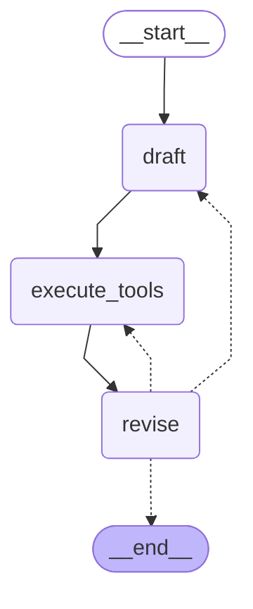

# reflexion-agent

The goal of this reflexion agent is to create a very detailed article about a topic we will provide.



### Tools for this project
- OpenAI GPT4 Turbo
- Function Calling
- Tavily (Search Engine)
- LangSmith

#### Prompting Concepts:
- **Ouput Parser** to get structure outputs

### Installation
After initialize the poetry project, you can add the following dependencies:
```sh
poetry add python-dotenv black isort langchain langchain-openai langgraph langchain-community
```

### Environment
Here is the template for the .env file:
```
OPENAI_API_KEY=<API Key from openai>
TAVILY_API_KEY=<Tavily API Key>
LANGCHAIN_API_KEY=<API Key from langsmith>
LANGCHAIN_TRACING_V2=true
LANGCHAIN_PROJECT=<name that will show up in the langsmith dashboard>
```

